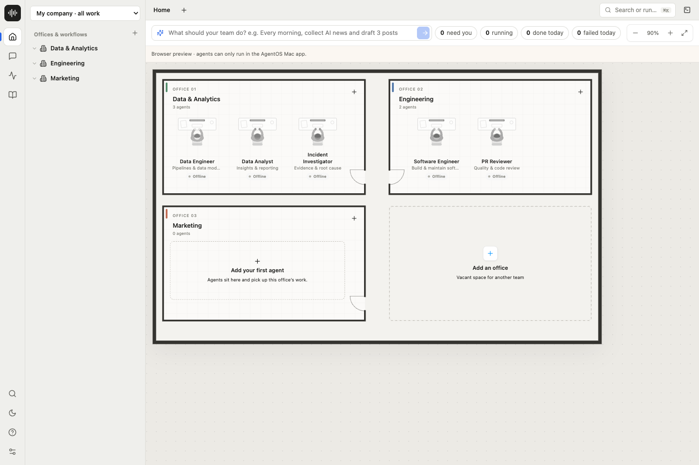
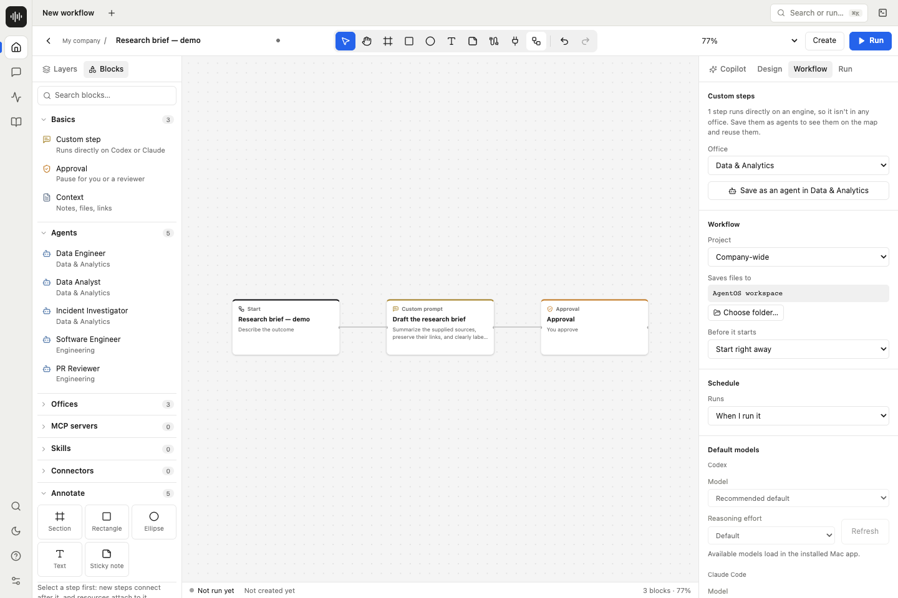
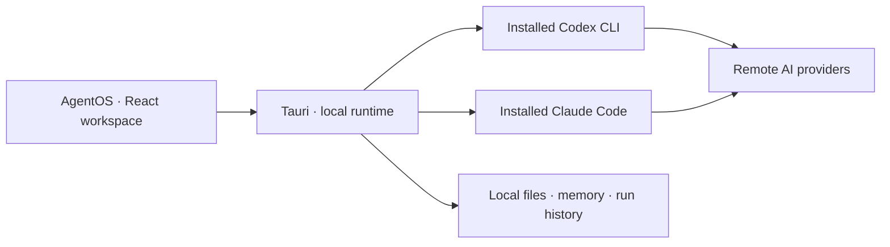

<p align="center">
  
</p>

<h1 align="center">AgentOS</h1>

<p align="center"><strong>A local workspace for your AI team.</strong><br />Organize agents. Build workflows. Review the work.</p>

<p align="center">
  <a href="https://github.com/mohammeddal/agentos/actions/workflows/ci.yml"></a>
  <a href="LICENSE"></a>
  
  
</p>

<p align="center"><a href="#quick-start">Quick start</a> · <a href="docs/USAGE.md">User guide</a> · <a href="docs/DEVELOPMENT.md">Development</a> · <a href="CONTRIBUTING.md">Contribute</a> · <a href="SECURITY.md">Security</a></p>



AgentOS is an open-source macOS app that brings **Codex and Claude Code** into one workspace. Group specialists into offices, connect steps on a visual canvas, give each step its context, and follow runs and approvals in one place. It uses the provider CLIs installed and signed in on your machine.

> **Early access:** native execution requires the Mac app. The browser is a planning preview. Source builds are unsigned; this project is not a security-audited or notarized production distribution.

## What you can do

- **Organize your team.** Create offices and agents with roles, instructions, engine choices, and skill references.
- **Build workflows by chatting with Copilot.** Describe your goal, ask for changes, and watch the canvas update. You can also connect steps, context, conditions, and approvals manually.
- **Work with context.** Scope notes, files, reviewed memory, and discovered provider capabilities to the steps that need them.
- **Follow execution.** Inspect provider progress, results, failures, cancellations, and pending approvals.
- **Keep a local workspace.** Save project structure, chats, workflows, memory, and run history on your machine.



Screenshots show the actual browser preview with demo data, not completed provider runs. See [image provenance](docs/images/README.md).

## Build a workflow by chatting

In the **native Mac app**, open **Home → New workflow → Copilot**, choose Codex or Claude Code, and describe the workflow you want:

> Build a workflow that researches a topic, drafts a brief with source links, and pauses for my approval.

Continue the conversation with changes such as “add a review step” or “give the writer more context.” Copilot applies supported changes to the canvas as an undoable edit. Inspect the steps, connections, provider choices, and approval gates, then save and run the workflow. Creating a plan does not run its work steps. Copilot needs a working provider sign-in; browser preview cannot generate a plan.

## Quick start

Use **Node.js 22.13+** (Node 22 LTS is the CI baseline) and **pnpm 9.15.2**. No `.env` file or API key is required for the browser preview.

```sh
git clone https://github.com/mohammeddal/agentos.git
cd agentos
corepack enable
corepack prepare pnpm@9.15.2 --activate
pnpm install --frozen-lockfile
pnpm dev
```

Open [127.0.0.1:4173](http://127.0.0.1:4173). Start at **Home**, explore the offices, and choose **New workflow**. Keep the development server on loopback; it includes local filesystem helpers.

### Run the native Mac app

Install Rust with Cargo and Xcode Command Line Tools, then:

```sh
pnpm dev:desktop
```

### Sign in to Codex or Claude Code

Sign in using the provider CLI in **macOS Terminal**, outside AgentOS. Install the provider you want first: [Codex CLI](https://developers.openai.com/codex/cli/) or [Claude Code](https://code.claude.com/docs/en/setup).

**Codex — ChatGPT browser sign-in:**

```sh
codex login
codex login status
```

**Claude Code — Anthropic browser sign-in:**

```sh
claude auth login
claude auth status
```

Complete the browser sign-in, then reopen AgentOS. Open **Settings** to check CLI detection and review autonomy, and choose that engine in **Chat** or **Copilot**. Send a short message to verify a real response. The current “Ready” label means the executable was found; it does not validate your login or quota.

AgentOS reuses these CLI sessions and does not provide its own provider login form, bundle providers, or copy credentials into the repository. Account eligibility, network access, and provider usage limits still apply. See [provider setup and test status](docs/PROVIDER-SETUP.md) for verification and troubleshooting. Official references: [Codex authentication](https://learn.chatgpt.com/docs/auth), [Claude CLI authentication commands](https://code.claude.com/docs/en/cli-reference).

**Latest live check (2026-10-05):** Codex passed real replies, conversation continuation, and persistence through AgentOS. Claude Code's adapter is implemented, but the live request failed with an invalid OAuth token (HTTP 401); successful Claude execution remains unverified pending reauthentication. [Full test scope](docs/PROVIDER-SETUP.md#verified-status--2026-10-05).

### Build from source

```sh
pnpm build       # Web assets and workspace packages
pnpm build:mac   # Local macOS .app and .dmg
```

Native bundles appear in `apps/desktop/src-tauri/target/release/bundle/`. Public binary distribution requires a separate signing and notarization process; see [Releasing](docs/RELEASING.md). Native Windows/Linux support is not verified.

## How it fits together



Local-first describes storage and orchestration, not offline inference. Relevant prompts and attachments go to the selected provider. Local records are not encrypted. Provider permissions and workflow approval checkpoints are separate; review both before running work. Capability discovery does not prove live access. [Read the execution boundaries](docs/LIVE-EXECUTION.md).

## Repository map

| Path                         | Purpose                                                      |
| ---------------------------- | ------------------------------------------------------------ |
| `apps/desktop/src/app`       | App shell, routing, and navigation                           |
| `apps/desktop/src/features`  | Company map, workflows, chat, memory, and execution UI       |
| `apps/desktop/src-tauri`     | Rust native runtime and macOS packaging                      |
| `apps/desktop/server`        | Local development services                                   |
| `packages`                   | Core runtime, schemas, policies, persistence, and plugin SDK |
| `apps/cli`, `plugins`        | Earlier core CLI and built-in capability manifest            |
| `docs`, `.github`, `scripts` | Guides, images, contribution templates, CI, and checks       |

Internal `@staffforge/*` names remain for compatibility. Earlier Studio, DataGuild, and Workbench experiences are retained under `src/legacy`; see [alternate experiences](docs/ALTERNATE-EXPERIENCES.md).

## Contribute and fork

Fork this repository, install dependencies with the frozen lockfile, and follow [CONTRIBUTING.md](CONTRIBUTING.md). CI checks source, types, tests, formatting, web/native builds, npm advisories, and secrets. Dependabot proposes dependency updates.

```sh
pnpm check:repo
pnpm check:secrets  # Requires Gitleaks 8.30.1
pnpm audit:source
pnpm typecheck
pnpm test
pnpm format:check
pnpm build
```

See the [documentation index](docs/README.md) and [publication audit](docs/PUBLICATION-AUDIT.md) for details and verification limits. Report vulnerabilities privately using [SECURITY.md](SECURITY.md).

## License

[MIT](LICENSE). You can use, modify, and distribute AgentOS under the license terms. Provider services and third-party dependencies have their own terms and licenses.
